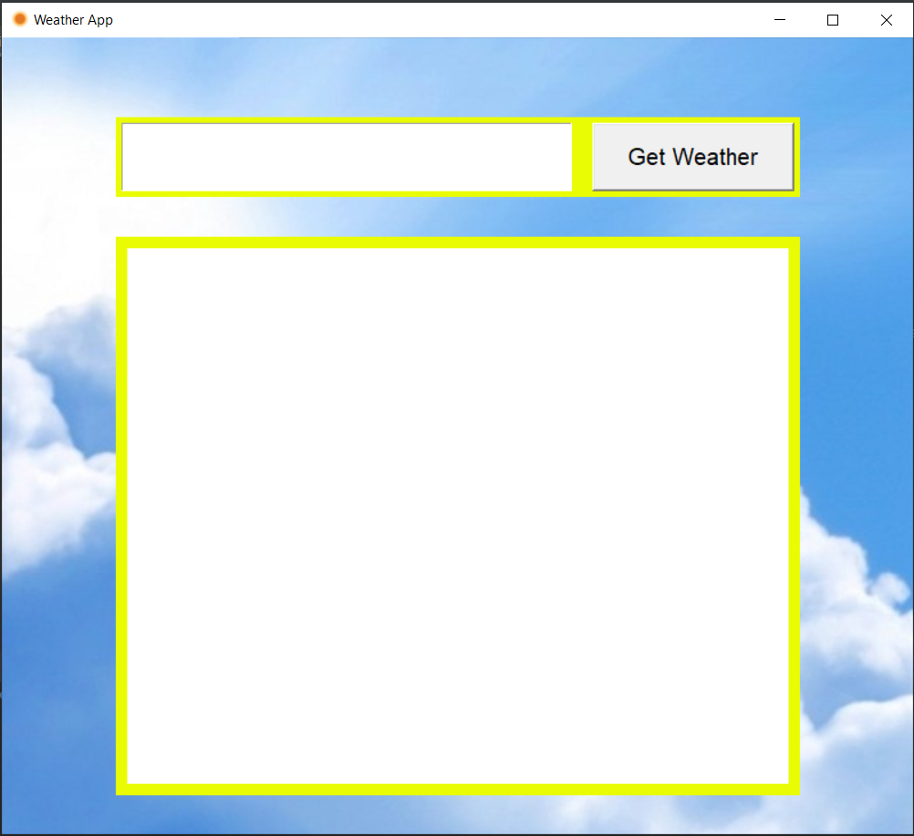
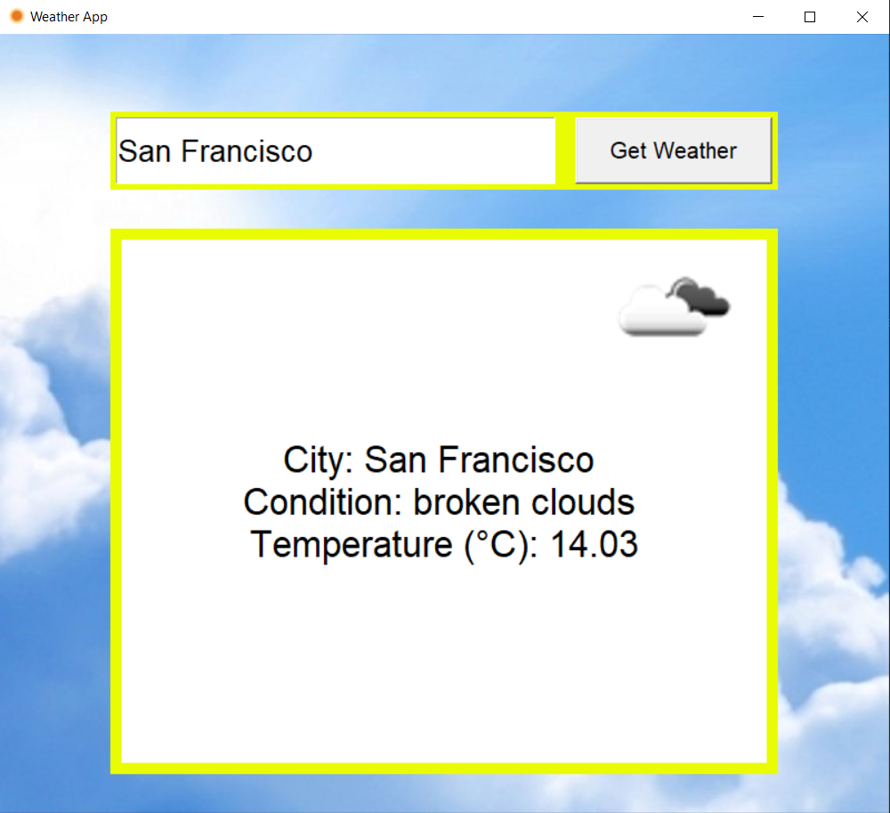
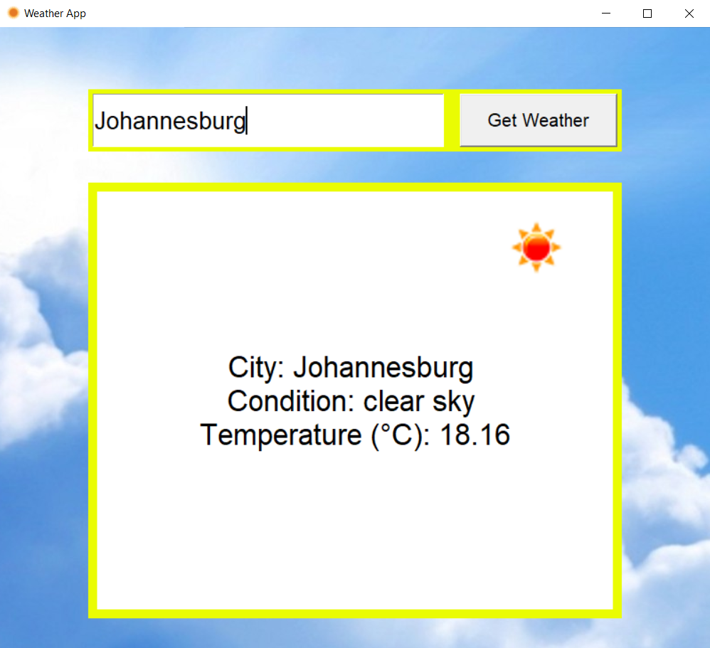
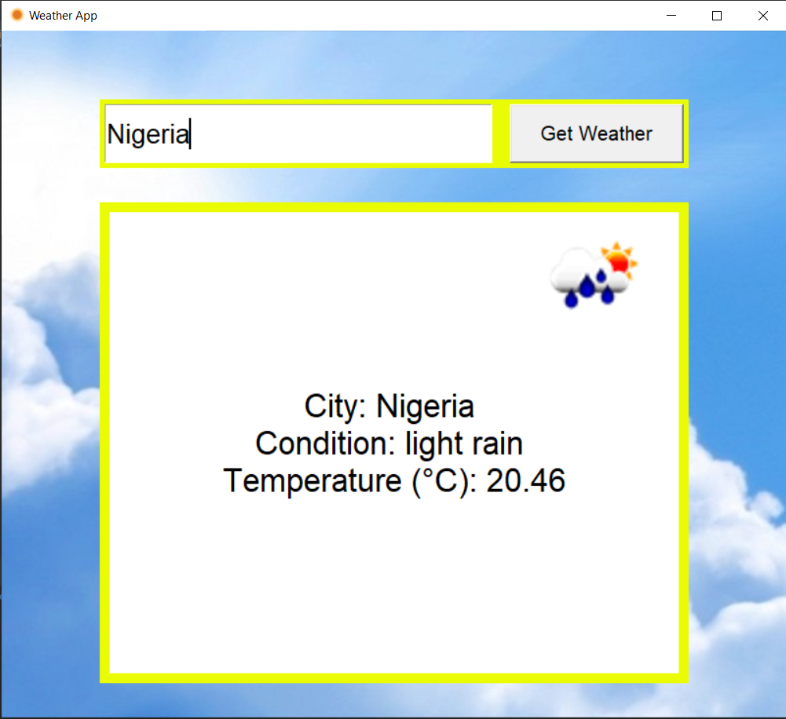
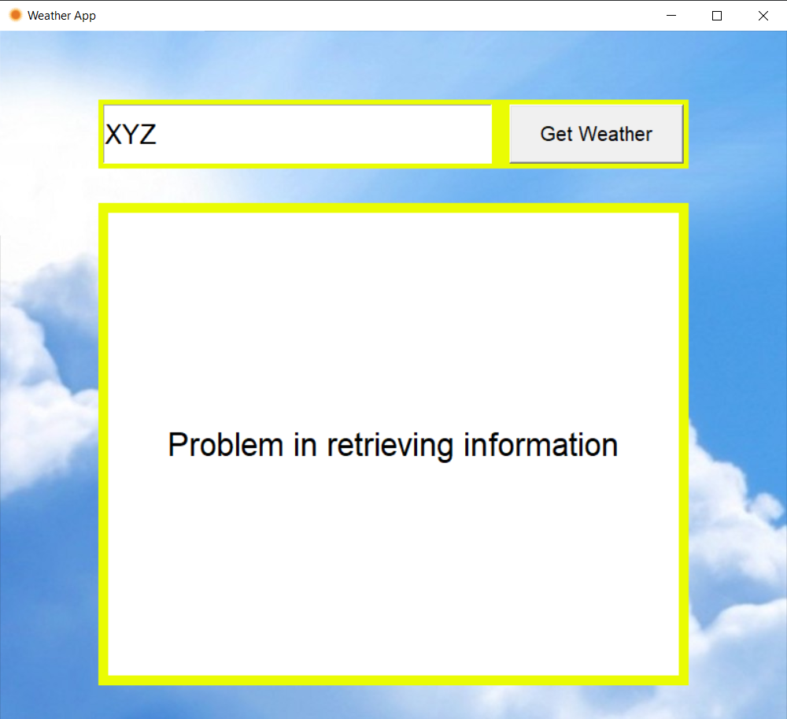

# Weather-App
Weather App is a GUI app in Python using Tkinter module which will tell you the current weather details of a particular city along with other details. 

## NOTE
It requires the openweathermap's API key to run. Set the "key" variable inside weather_utils.py before running.

It requires Tkinter package. Install it, after that Run using: 'main.py'

## Weather App Screenshots

